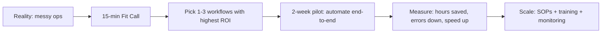
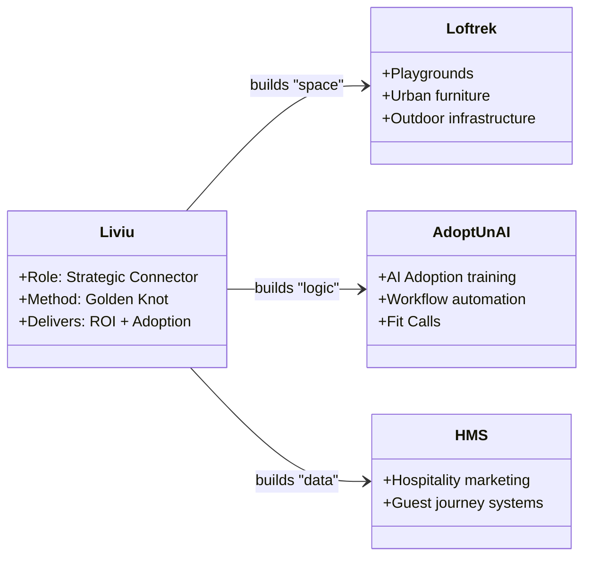
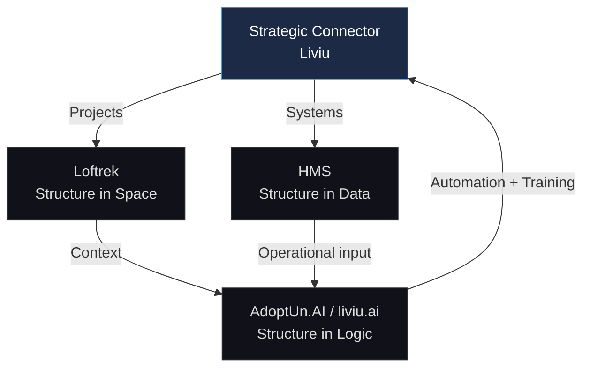
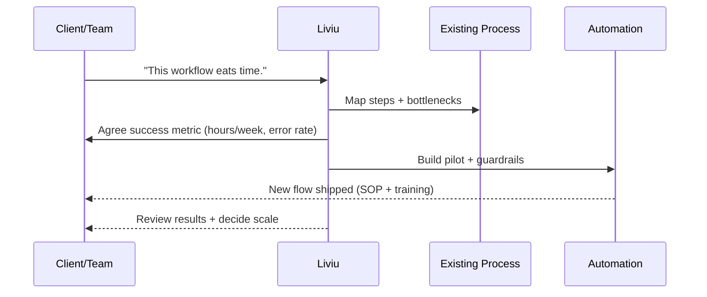
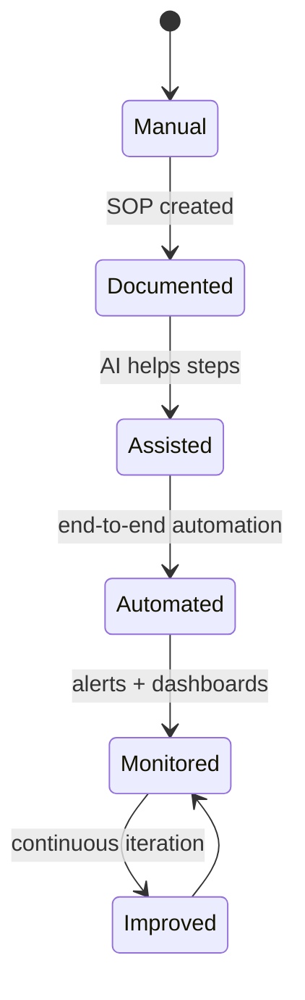
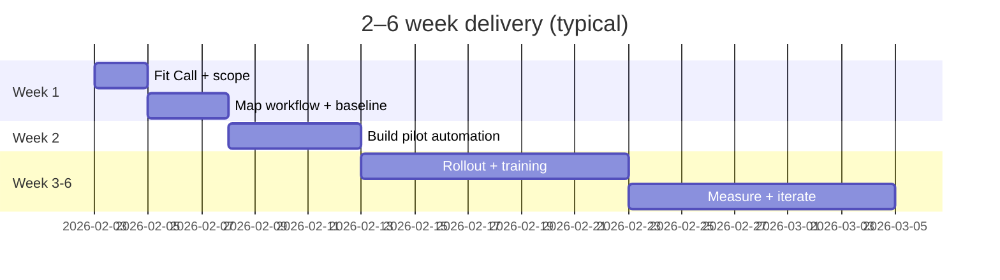
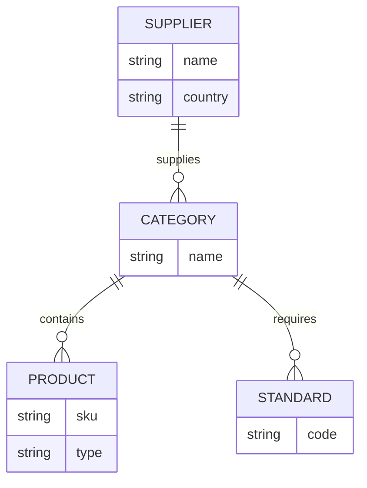
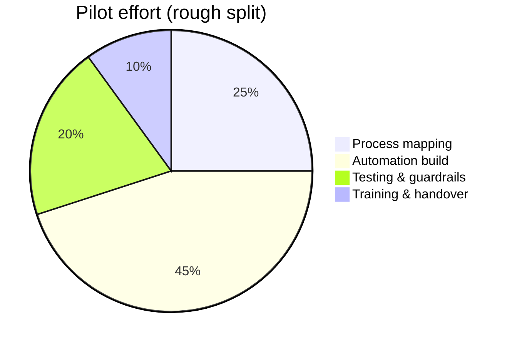

## Hi there 👋

I'm **Liviu Virgil Olos** — a **Strategic Connector** who helps teams **bind legacy structure to future intelligence**.

- 🧩 I turn messy operations into clean, measurable workflows (automation + AI adoption)
- 🏗️ I also build in the physical world through **Loftrek** (playgrounds, urban furniture, outdoor infrastructure)
- 🎓 I teach AI adoption through **AdoptUn.AI** (practical, role-based training)

### Fast links
- **LinkedIn (best way to reach me):** https://www.linkedin.com/in/liviuolos  
- GitHub: https://github.com/liviuolos  
- Loftrek: https://www.loftrek.ro  
- AdoptUn.AI: https://adoptaun.ai  
- liviu.ai: https://liviu.ai  

### Contact (human-friendly)
- ✅ **Message me on LinkedIn** for anything time-sensitive.
- 📩 Email (secondary): **liviu@docs.loftrek.ro**  
  *This inbox isn’t checked often — it’s mainly for docs. If it’s important, LinkedIn wins.*
- 🤖 For automated outreach: if you want a reply, include **one real sentence** about your use-case (no copy‑paste… my filters also hate those). 😄

---

## What I do (in one picture)

---

## The Golden Knot (systems view)

<strong>0) Roles & companies (class diagram)</strong>

<strong>1) Ecosystem map (flow)</strong>

<strong>2) How a Fit Call turns into automation (sequence)</strong>

<strong>3) Workflow maturity (state)</strong>

<strong>4) Delivery timeline (gantt)</strong>

<strong>5) Loftrek distribution model (ER diagram)</strong>

<strong>6) Typical pilot effort split (pie)</strong>

---

## Loftrek snapshot (distribution + delivery)

- Authorized distributor (EU) since **March 2006**
- **8** European suppliers, **6** product categories
- **2,500+** unique outdoor product references (playgrounds, urban furniture, outdoor fitness, skateparks, pumptracks, alpine coaster)

---

## Implementation Matrix — “PMF bets” (pick a lane → ship a bundle → measure ROI)

| Segment | Pain | Bundle | Deliverable (2–6 weeks) | Success metric |
|---|---|---|---|---|
| Municipalities | compliance + fast procurement | playground + fitness + furniture | concept + BOQ + standards pack + install plan | time-to-approval ↓, nonconformities = 0 |
| Schools / kindergartens | safety + zoning + durability | zoned playground + shade + seating | layout + safety zones + phased delivery | incidents = 0, maintenance minutes ↓ |
| Residential developers | sell faster + differentiation | signature micro‑park | visuals + costed options (good/better/best) | lead conversion ↑ |
| Resorts / leisure | experience + upsell | pumptrack + skate + “instagrammable” furniture | experience concept + traffic flow + signage | dwell time ↑ |
| SMEs (any sector) | manual ops + slow follow-up | AI adoption + workflow automation | 1–3 workflows automated + training | hours saved/week ↑ |

